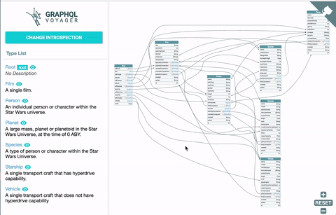

# GraphQL Voyager
[](https://www.jsdelivr.com/package/npm/graphql-voyager)
[](https://david-dm.org/APIs-guru/graphql-voyager)
[](https://david-dm.org/APIs-guru/graphql-voyager?type=dev)
[](https://opensource.org/licenses/MIT)


Represent any GraphQL API as an interactive graph. It's time to finally see **the graph** behind GraphQL.
You can also explore number of public GraphQL APIs from [our list](https://github.com/APIs-guru/graphql-apis).

> With graphql-voyager you can visually explore your GraphQL API as an interactive graph. This is a great tool when designing or discussing your data model. It includes multiple example GraphQL schemas and also allows you to connect it to your own GraphQL endpoint. What are you waiting for, explore your API!

_[GraphQL Weekly #42](https://graphqlweekly.com/issues/42)_

## [Live Demo](https://apis.guru/graphql-voyager/)
[](https://apis.guru/graphql-voyager/)

## Features
  + Quick navigation on graph
  + Left panel which provides more detailed information about every type
  + "Skip Relay" option that simplifies graph by removing Relay wrapper classes
  + Ability to choose any type to be a root of the graph

## Roadmap
  - [x] Major refactoring
  - [ ] Publish as a library ([issue 1](https://github.com/APIs-guru/graphql-voyager/issues/1))
  - [ ] Tests + CI + CD
  - [ ] Try to optimize graph auto-layout
  - [ ] [ < place for your ideas > ](https://github.com/APIs-guru/graphql-voyager/issues/new)

## Usage
GraphQL Voyager exports `Voyager` React component and helper `init` function. If used without
module system it is exported as `GraphQLVoyager` global variable.

### Properties
`Voyager` component accepts the following properties:

+ `introspection` [`object` or function: `(query: string) => Promise`] - the server introspection response. If `function` is provided GraphQL Voyager will pass introspection query as a first function parameter. Function should return `Promise` which resolves to introspection response object.
+ `displayOptions` _(optional)_
  + `displayOptions.skipRelay` [`boolean`, default `true`] - skip relay-related entities
  + `displayOptions.rootType` [`string`] - name of the type to be used as a root
  + `displayOptions.sortByAlphabet` [`boolean`, default `false`] - sort fields on graph by alphabet
  + `displayOptions.showLeafFields` [`boolean`, default `true`] - show all scalars and enums
  + `displayOptions.hideRoot` [`boolean`, default `false`] - hide the root type
+ `hideDocs` [`boolean`, default `false`] - hide the docs sidebar
+ `hideSettings` [`boolean`, default `false`] - hide settings panel
+ `workerURI` [`string`] _(optional)_ - absolute or relative path to Voyager web worker. By default it will try to load it from `voyager.worker.js`.
+ `loadWorker` [function: `(path: string, relative: boolean) => Promise<Worker>`] _(optional)_ - If provided GraphQL Voyager will use this function to load the worker. By default it will use the internal callback in `utils/index.ts`

### `init` function
The signature of the `init` function:

```js
(hostElement: HTMLElement, options: object) => void
```

+ `hostElement` - parent element
+ `options` - is the JS object with [properties](#properties) of `Voyager` component

### Using pre-bundled version
You can get GraphQL Voyager bundle from the following places:
+ jsDelivr CDN
  + some exact version - https://cdn.jsdelivr.net/npm/graphql-voyager/v1.0.0-rc.15/voyager.min.js
  + latest version - https://cdn.jsdelivr.net/npm/graphql-voyager/dist/voyager.min.js
+ from `dist` folder of the npm package `graphql-voyager`

**Important:** for the latest two options make sure to copy `voyager.worker.js` to the same
folder as `voyager.min.js`.

**The HTML with minimal setup** (see the full [example](./example))

```html
<!DOCTYPE html>
<html>
  <head>
    <script src="https://cdn.jsdelivr.net/npm/react@16/umd/react.production.min.js"></script>
    <script src="https://cdn.jsdelivr.net/npm/react-dom@16/umd/react-dom.production.min.js"></script>

    <link rel="stylesheet" href="https://cdn.jsdelivr.net/npm/graphql-voyager/dist/voyager.css" />
    <script src="https://cdn.jsdelivr.net/npm/graphql-voyager/dist/voyager.min.js"></script>
  </head>
  <body>
    <div id="voyager">Loading...</div>
    <script>
      function introspectionProvider(introspectionQuery) {
        // ... do a call to server using introspectionQuery provided
        // or just return pre-fetched introspection
      }

      // Render <Voyager />
      GraphQLVoyager.init(document.getElementById('voyager'), {
        introspection: introspectionProvider
      })
    </script>
  </body>
</html>
```

### Using as a dependency
You can install lib using `npm` or `yarn`:

    npm i --save graphql-voyager
    yarn add graphql-voyager

And then use it:

```js
import * as React from 'react';
import * as ReactDOM from 'react-dom';
import {Voyager} from 'graphql-voyager';
import fetch from 'isomorphic-fetch';

function introspectionProvider(query) {
  return fetch(window.location.origin + '/graphql', {
    method: 'post',
    headers: { 'Content-Type': 'application/json' },
    body: JSON.stringify({query: query}),
  }).then(response => response.json());
}

ReactDOM.render(<Voyager introspection={introspectionProvider} />, document.getElementById('voyager'));
```

Build for the web with [webpack](https://webpack.js.org/) ([example](./example/webpack-example)) or
[browserify](http://browserify.org/)

**Important:** make sure to copy `voyager.worker.js` from `node_modules/graphql-voyager/dist` to the same folder as your main bundle or use [`workerURI`](#properties) property to specify other path.

**NOTE** if you use it with `create-react-app`, copy worker file to `public` folder and use `workerURI` property like this:

```jsx
  <Voyager
      // ...
      workerURI={process.env.PUBLIC_URL + '/voyager.worker.js'}
      // ...
  />
```

## Middleware
Graphql Voyager has middleware for the next frameworks:

### Properties
Middleware supports the following properties:

 + `endpointUrl` [`string`] - the GraphQL endpoint url.
 + `displayOptions` [`object`] - same as [here](#properties)
 + `headersJS` [`string`, default `"{}"`] - object of headers serialized in string to be used on endpoint url<BR>
 **Note:** You can also use any JS expression which results in an object with header names as keys and strings as values e.g. `{ Authorization: localStorage['Meteor.loginToken'] }`

### Express

```js
import express from 'express';
import { express as voyagerMiddleware } from 'graphql-voyager/middleware';

const app = express();

app.use('/voyager', voyagerMiddleware({ endpointUrl: '/graphql' }));

app.listen(3001);
```

### Hapi

#### Version 17+
```js
import hapi from 'hapi';
import { hapi as voyagerMiddleware } from 'graphql-voyager/middleware';

const server = new Hapi.Server({
  port: 3001
});

const init = async () => {
  await server.register({
    plugin: voyagerMiddleware,
    options: {
      path: '/voyager',
      endpointUrl: '/graphql'
    }
  });

  await server.start();
};

init();
```

#### Legacy Versions
```js
import hapi from 'hapi';
import { hapiLegacy as voyagerMiddleware } from 'graphql-voyager/middleware';

const server = new Hapi.Server();

server.connection({
  port: 3001
});

server.register({
  register: voyagerMiddleware,
  options: {
    path: '/voyager',
    endpointUrl: '/graphql'
  }
},() => server.start());
```

### Koa

```js
import Koa from 'koa';
import KoaRouter from 'koa-router';
import { koa as voyagerMiddleware } from 'graphql-voyager/middleware';

const app = new Koa();
const router = new KoaRouter();

router.all('/voyager', voyagerMiddleware({
  endpointUrl: '/graphql'
}));

app.use(router.routes());
app.use(router.allowedMethods());
app.listen(3001);
```

## Credits
This tool is inspired by [graphql-visualizer](https://github.com/NathanRSmith/graphql-visualizer) project.
